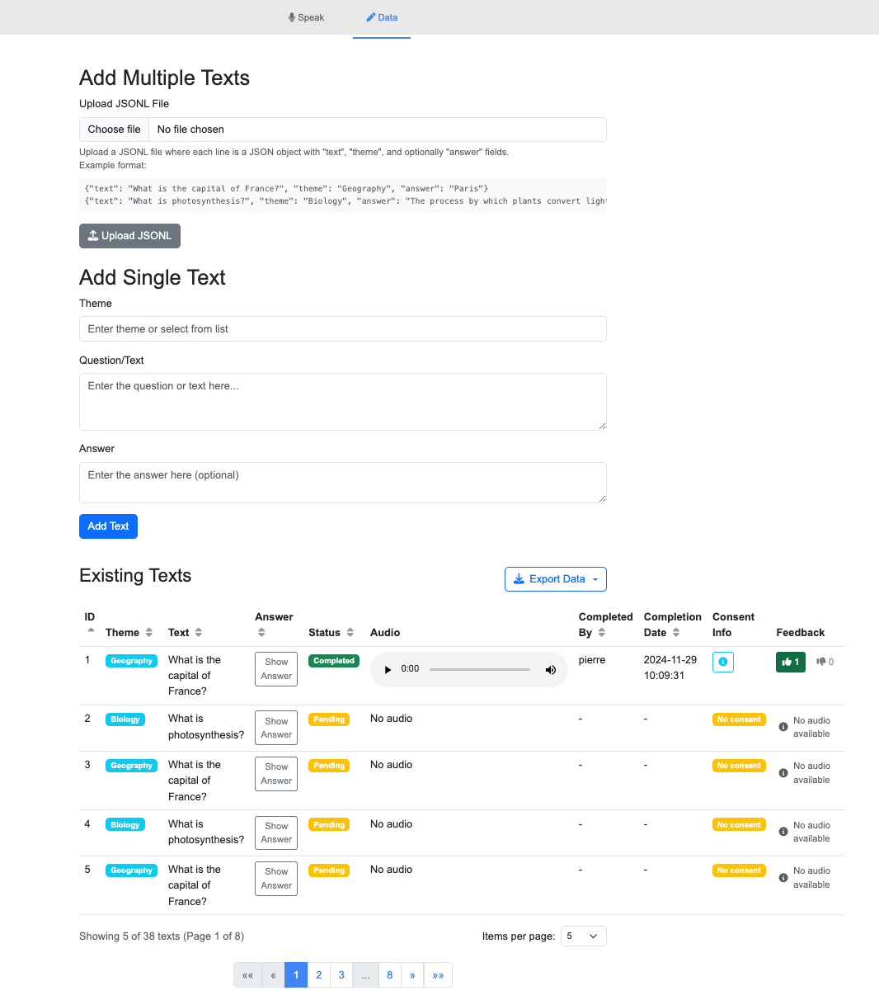
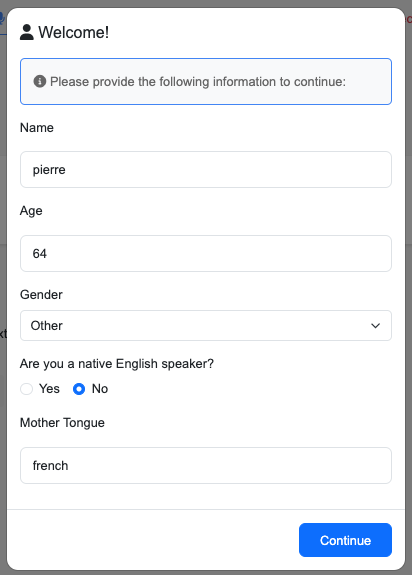

# Web Audio Recorder

A web application for collecting audio recordings with user consent for research purposes. This application allows users to record their voice while reading texts, and includes features for managing texts, themes, and user consent.

## Screenshots

### Main Recording Interface


The main interface where users can record their voice. It includes:
- Text display with theme
- Recording controls (Record, Delete, Submit)
- Audio playback
- Progress tracking

### Data Management



The data management interface allows administrators to:
- Add new texts manually
- Upload texts in bulk via JSONL
- View all recordings
- Monitor completion status
- Access consent information

### Username Input



Users must provide a username that will be:
- Stored locally
- Used to track recordings
- Associated with consent information

## Features

- **Audio Recording**
  - Browser-based voice recording
  - Playback before submission
  - Quality control options

- **Text Management**
  - Theme categorization
  - Answer field for questions
  - Bulk import via JSONL
  - Progress tracking

- **User Management**
  - Local storage of username
  - Consent tracking
  - Recording history

- **Data Collection**
  - Audio files storage
  - Consent information
  - User metadata
  - Browser information

## Technical Details

- Built with Flask (Python)
- SQLite database
- Bootstrap for UI
- MediaRecorder API for audio capture

## Installation

### Prerequisites
- Python 3.8 or higher
- pip (Python package installer)
- Git

### Steps

1. Clone the repository
2. Install dependencies:
   ```bash
   pip install -r requirements.txt
   ```
3. Run the application:
   ```bash
   python app.py
   ```
4. Open your browser and navigate to http://127.0.0.1:5000/
5. Enjoy! 🚀🚀

## Contributing

We welcome contributions to the Web Audio Recorder project! Here's how you can help:

### Ways to Contribute

1. **Report Bugs**
   - Use the GitHub issue tracker
   - Include detailed steps to reproduce
   - Specify your browser and OS
   - Include screenshots if relevant

2. **Suggest Enhancements**
   - Open an issue with the "enhancement" tag
   - Explain the use case
   - Describe expected behavior

3. **Code Contributions**
   - Fork the repository
   - Create a feature branch
   - Write clean, documented code
   - Submit a pull request

## License

```plaintext
Apache License
                           Version 2.0, January 2004
                        http://www.apache.org/licenses/

Copyright (c) 2024 Université d'Avignon

Licensed under the Apache License, Version 2.0 (the "License");
you may not use this file except in compliance with the License.
You may obtain a copy of the License at

    http://www.apache.org/licenses/LICENSE-2.0

Unless required by applicable law or agreed to in writing, software
distributed under the License is distributed on an "AS IS" BASIS,
WITHOUT WARRANTIES OR CONDITIONS OF ANY KIND, either express or implied.
See the License for the specific language governing permissions and
limitations under the License.
```

### Additional Terms for Audio Recordings

The audio recordings collected through this application are subject to separate terms:

1. **Research Use**: All audio recordings are collected for research purposes and may be used in academic research projects.

2. **Public Release**: By contributing audio recordings, users consent to their recordings being:
   - Publicly released
   - Used in research
   - Shared with other researchers
   - Used in future studies
   - Used in commercial products

3. **Attribution**: While not required, appropriate academic citation is appreciated when using the recordings in research.

```bibtex
@misc{labrak2024web,
  author = {Labrak, Yanis},
  title = {Web Audio Recorder},
  year = {2024},
  howpublished = {\url{https://github.com/yanis-labrak/web-audio-recorder}}
}
```

4. **User Rights**: Contributors maintain the right to:
   - Request removal of their recordings
   - Withdraw consent at any time
   - Access their recorded data

## Contact

For any questions or issues, please contact:
- yanis.labrak@univ-avignon.fr
